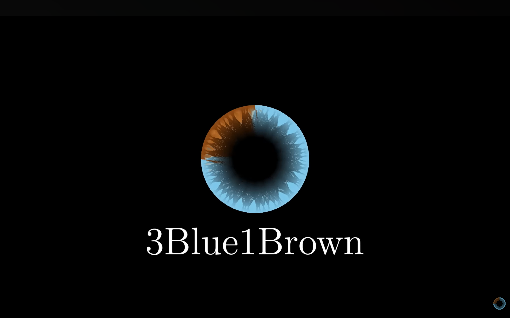

# Prerequisite knowledge

## Matrix

Before we start, you should have a basic idea about what a matrix is. If you don't know, you can click and watch 3b1b's video about that. Even if you have already learned about matrix, it is still good to make a quick review.

---

## References

3Blue1Brown. "Linear Transformations and Matrices | Chapter 3, Essence of Linear Algebra." *Bilibili*, 27 Aug. 2016, <www.bilibili.com/video/BV1ns41167b9/>.
